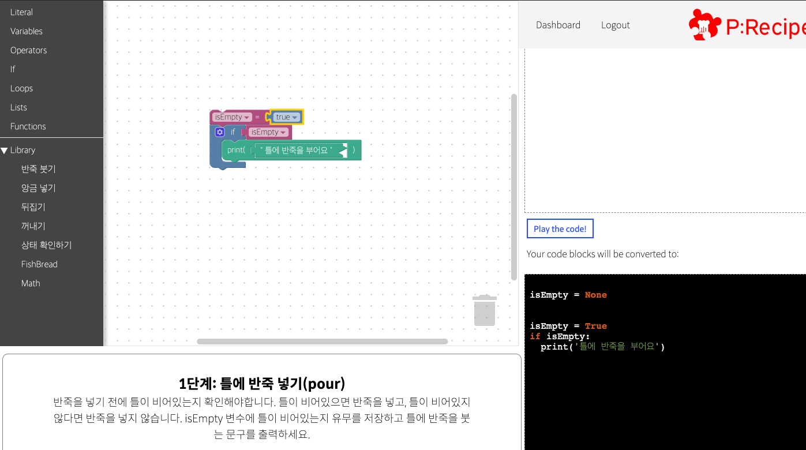

    

# P:Recipe (Programming Recipe)

> Programming Recipe의 줄임말로, 레시피를 활용해 요리를 하는 행위와 같이 프로그래밍을 레시피, 즉 특정한 매커니즘에 의하여 쉽게 배우고 즐길 수 있는 프로그래밍 교육 서비스입니다.

**아주대학교 파란학기 프로젝트**로 개발되었으며, Ruby on Rails를 활용합니다.

프로젝트 진행기간 : 2017. 03 ~ 2017. 06

